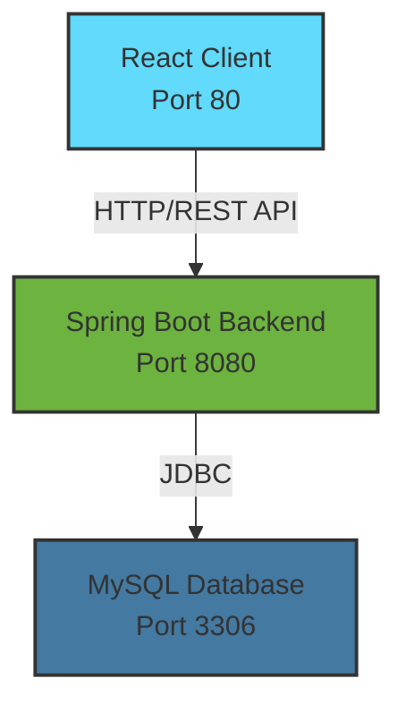

<div align="center">

# 📱 PhoneStore - E-Commerce Platform

### *A full-stack e-commerce web application for selling mobile phones*


[🚀 Getting Started](#-installation--setup) • [📖 Documentation](#-api-endpoints) • [🐳 Docker](#-docker-deployment) • [📞 Support](#-support)

---

</div>

## 📋 Table of Contents

- [Features](#-features)
- [Tech Stack](#-tech-stack)
- [Architecture](#-architecture)
- [Prerequisites](#-prerequisites)
- [Installation & Setup](#-installation--setup)
- [Configuration](#%EF%B8%8F-configuration)
- [Running the Application](#-running-the-application)
- [API Endpoints](#-api-endpoints)
- [Project Structure](#-project-structure)
- [Docker Deployment](#-docker-deployment)
- [Environment Variables](#-environment-variables)
- [Testing](#-testing)

---

## ✨ Features

<table>
<tr>
<td width="50%" valign="top">

### 🛒 Customer Features

- ✅ **User Authentication**: Secure registration and login with JWT-based authentication
- 🔐 **Password Recovery**: Forgot password functionality with email verification
- 🔍 **Product Browsing**: Browse products with search and category filtering
- 📱 **Product Details**: View detailed product information with images
- 🛍️ **Shopping Cart**: Add, update, and remove items from shopping cart
- 📦 **Order Management**: Place orders and track order status
- 📍 **Address Management**: Add and edit shipping addresses
- 💳 **Payment Processing**: Secure payment handling for orders
- 📜 **Order History**: View past orders and their details
- 👤 **User Profile**: Manage personal information and account settings

</td>
<td width="50%" valign="top">

### 🔧 Admin Features

- 📊 **Dashboard**: Comprehensive admin dashboard with statistics
- 📦 **Product Management**: Create, update, delete, and manage products
- 🏷️ **Category Management**: Organize products into categories
- 📋 **Order Management**: View, approve, reject, and update order statuses
- 👥 **Customer Management**: View and manage customer accounts
- 💰 **Revenue Analytics**: View revenue statistics and reports
- 🔑 **Account Management**: Create and manage admin accounts
- 📸 **Image Upload**: Upload product images to AWS S3

</td>
</tr>
</table>

---

## 🛠 Tech Stack

<div align="center">

### Backend Technologies


### Frontend Technologies


### DevOps & Tools


</div>

<details>
<summary><b>📦 Detailed Tech Stack</b></summary>

### Backend
- **Framework**: Spring Boot 3.3.1
- **Language**: Java 17
- **Security**: Spring Security with JWT (JSON Web Tokens)
- **Database**: MySQL 8.0
- **ORM**: Spring Data JPA / Hibernate
- **Build Tool**: Maven
- **Cloud Storage**: AWS S3 SDK
- **Email Service**: Spring Mail (SMTP)
- **Validation**: Spring Validation

### Frontend
- **Framework**: React 19.1.0
- **Routing**: React Router DOM 7.5.1
- **HTTP Client**: Axios 1.8.4
- **Icons**: React Icons 5.5.0
- **Build Tool**: Create React App
- **Web Server**: Nginx (production)

### DevOps
- **Containerization**: Docker & Docker Compose
- **Web Server**: Nginx
- **Hosting + Server**: AWS EC2 + AWS S3

</details>

---

## 🏗 Architecture

<div align="center">



</div>

The application follows a **three-tier architecture**:

### 🔑 Key Components

| Component | Description |
|-----------|-------------|
| **RESTful API** | Backend exposes REST endpoints for all operations |
| **JWT Authentication** | Stateless authentication using JSON Web Tokens |
| **Role-Based Access Control** | Separate user and admin roles |
| **File Storage** | AWS S3 integration for product image storage |
| **Email Service** | SMTP-based email for password reset functionality |

---

## 📦 Prerequisites

Before you begin, ensure you have the following installed:

| Tool | Version | Notes |
|------|---------|-------|
| ☕ **Java Development Kit (JDK)** | 17+ | OpenJDK or Oracle JDK |
| 🟢 **Node.js** | 18+ | Includes npm |
| 📦 **npm** | 8+ | Comes with Node.js |
| 🔨 **Maven** | 3.6+ | Build tool |
| 🐬 **MySQL** | 8.0+ | Database |
| 🐳 **Docker** *(optional)* | 20.10+ | For containerization |
| 🐙 **Docker Compose** *(optional)* | 2.0+ | Multi-container management |

### Optional Services
- **AWS Account**: For S3 image storage (can be configured later)
- **SMTP Email Account**: For password reset functionality (Gmail recommended)

---

## 🚀 Installation & Setup

There are two ways to run this application:

<table>
<tr>
<th width="50%">💻 Standalone Development</th>
<th width="50%">🐳 Full Docker Deployment</th>
</tr>
<tr>
<td valign="top">

**Database**: Docker container  
**Backend**: Local machine (port 8080)  
**Frontend**: Local machine (port 3000)  

✅ Hot Reload: Yes (automatic)  
✅ Debugging: Easy (IDE integration)  
⚡ Resource Usage: Lower  
🎯 Best For: Development & Testing

</td>
<td valign="top">

**Database**: Docker container  
**Backend**: Docker container (port 8080)  
**Frontend**: Docker container (port 80)  

❌ Hot Reload: No (requires rebuild)  
⚠️ Debugging: More complex  
🔋 Resource Usage: Higher  
🎯 Best For: Production & Demo

</td>
</tr>
</table>

---

### Option 1: Standalone Development

> **Recommended for development** - Run backend and frontend locally, database in Docker

#### Step 1️⃣: Clone the Repository

```bash
git clone <repository-url>
cd ltweb
```

#### Step 2️⃣: Start MySQL Database with Docker

```bash
# Start only the MySQL service from docker-compose
docker-compose up -d mysql

# Verify MySQL is running
docker-compose ps mysql

# View MySQL logs (optional)
docker-compose logs -f mysql
```

The MySQL database will be available at `localhost:3306` with:
- **Database**: `spring_ecommerce_db`
- **Username**: `root`
- **Password**: `root`

> **Note**: The database will be automatically created on first startup.

#### Step 3️⃣: Backend Setup

```bash
cd backend

# Update application.properties with database credentials
# The default configuration should work with Docker MySQL:
# spring.datasource.url=jdbc:mysql://localhost:3306/spring_ecommerce_db
# spring.datasource.username=root
# spring.datasource.password=root

# Build the project
mvn clean install

# Run the application
mvn spring-boot:run
```

The backend will start on `http://localhost:8080`

#### Step 4️⃣: Frontend Setup

```bash
cd frontend

# Install dependencies
npm install

# Start development server
npm start
```

The frontend will start on `http://localhost:3000` and automatically open in your browser.

#### Step 5️⃣: Stop Database (when done)

```bash
# Stop MySQL container
docker-compose stop mysql

# Or remove the container (data persists in volume)
docker-compose down mysql
```

---

### Option 2: Full Docker Deployment

> **Recommended for production** - Run all services in Docker containers

#### Step 1️⃣: Clone the Repository

```bash
git clone <repository-url>
cd ltweb
```

#### Step 2️⃣: Configure Environment Variables (Optional)

Create a `.env` file in the root directory for production settings:

```env
# AWS S3 Configuration (optional)
AWS_S3_ACCESS_KEY=your_access_key
AWS_S3_SECRET_KEY=your_secret_key

# Email Configuration (optional)
SPRING_MAIL_USERNAME=your_email@gmail.com
SPRING_MAIL_PASSWORD=your_app_password

# Frontend API URL
REACT_APP_API_URL=http://localhost:8080

# Frontend URL for password reset
APP_FRONTEND_URL=http://localhost:80
```

> **Note**: If you don't create a `.env` file, the application will use default values from `docker-compose.yml`.

#### Step 3️⃣: Build and Run with Docker Compose

```bash
# Build and start all services (MySQL, Backend, Frontend)
docker-compose up -d

# View logs from all services
docker-compose logs -f

# View logs from a specific service
docker-compose logs -f backend
docker-compose logs -f frontend
docker-compose logs -f mysql

# Check service status
docker-compose ps
```

#### Step 4️⃣: Access the Application

| Service | URL | Description |
|---------|-----|-------------|
| 🌐 **Frontend** | http://localhost:80 | User interface |
| 🔧 **Backend API** | http://localhost:8080 | REST API endpoints |
| 🗄️ **MySQL** | localhost:3306 | Database |

#### Step 5️⃣: Stop Services

```bash
# Stop all services
docker-compose down

# Stop and remove volumes (⚠️ This will delete database data)
docker-compose down -v
```

#### Step 6️⃣: Rebuild After Code Changes

```bash
# Rebuild and restart all services
docker-compose up -d --build

# Rebuild specific service
docker-compose up -d --build backend
docker-compose up -d --build frontend
```

---

## ⚙️ Configuration

### Backend Configuration

Edit `backend/src/main/resources/application.properties`:

```properties
# Database Configuration
spring.datasource.url=jdbc:mysql://localhost:3306/spring_ecommerce_db
spring.datasource.username=root
spring.datasource.password=your_password

# JWT Configuration
security.jwt.secret-key=your_secret_key_here
security.jwt.expiration-time=3600000

# AWS S3 Configuration
aws.s3.accessKey=your_access_key
aws.s3.secretKey=your_secret_key

# Email Configuration
spring.mail.host=smtp.gmail.com
spring.mail.port=587
spring.mail.username=your_email@gmail.com
spring.mail.password=your_app_password

# Admin Account
admin.email=admin@gmail.com
admin.password=Admin1234@@
```

### Frontend Configuration

The frontend API URL can be configured via environment variable:
```bash
REACT_APP_API_URL=http://localhost:8080
```

Or set it in `docker-compose.yml` for Docker deployment.

---

## 🏃 Running the Application

### Standalone Development Mode

This mode runs backend and frontend locally while using Docker for the database.

<details>
<summary><b>📖 Click to expand detailed instructions</b></summary>

#### Step 1: Start Database
```bash
# Start MySQL in Docker
docker-compose up -d mysql

# Wait a few seconds for MySQL to initialize
# Check if MySQL is ready
docker-compose ps mysql
```

#### Step 2: Start Backend
Open a terminal and run:
```bash
cd backend
mvn spring-boot:run
```
Backend will be available at `http://localhost:8080`

#### Step 3: Start Frontend
Open another terminal and run:
```bash
cd frontend
npm start
```
Frontend will automatically open at `http://localhost:3000`

#### Stop Services
```bash
# Stop backend: Press Ctrl+C in backend terminal
# Stop frontend: Press Ctrl+C in frontend terminal
# Stop database:
docker-compose stop mysql
```

</details>

### Full Docker Mode

This mode runs all services in Docker containers.

<details>
<summary><b>📖 Click to expand detailed instructions</b></summary>

#### Start All Services
```bash
# Start all services (MySQL, Backend, Frontend)
docker-compose up -d

# View logs
docker-compose logs -f
```

#### Access the Application
- **Frontend**: Open browser at `http://localhost:80`
- **Backend API**: Available at `http://localhost:8080`
- **API Health Check**: `http://localhost:8080/product/get-all`

#### Stop All Services
```bash
# Stop all services
docker-compose down

# Stop and remove volumes (⚠️ deletes database data)
docker-compose down -v
```

#### Restart Services
```bash
# Restart all services
docker-compose restart

# Restart specific service
docker-compose restart backend
docker-compose restart frontend
docker-compose restart mysql
```

</details>

### Production Build (Manual)

If you want to build and run manually without Docker:

<details>
<summary><b>📖 Click to expand production build instructions</b></summary>

#### Backend Production Build
```bash
cd backend

# Build JAR file
mvn clean package

# Run the JAR
java -jar target/backend-1.0-SNAPSHOT.jar
```

#### Frontend Production Build
```bash
cd frontend

# Build for production
npm run build

# The build folder contains optimized production files
# Serve using a web server like nginx, apache, or serve
# Example with serve (install: npm install -g serve)
serve -s build -l 80
```

</details>

---

## 📡 API Endpoints

### 🔐 Authentication

| Method | Endpoint | Description |
|--------|----------|-------------|
| `POST` | `/auth/register` | Register a new user |
| `POST` | `/auth/login` | User login |
| `POST` | `/auth/forgot-password` | Request password reset |
| `POST` | `/auth/reset-password` | Reset password with token |

### 📦 Products

| Method | Endpoint | Description | Access |
|--------|----------|-------------|--------|
| `GET` | `/product/get-all` | Get all products | Public |
| `GET` | `/product/get-by-product-id/{id}` | Get product by ID | Public |
| `GET` | `/product/get-by-category-id/{id}` | Get products by category | Public |
| `GET` | `/product/search` | Search products | Public |
| `POST` | `/product/create` | Create product | Admin only |
| `PUT` | `/product/update` | Update product | Admin only |
| `DELETE` | `/product/delete/{id}` | Delete product | Admin only |

### 🏷️ Categories

| Method | Endpoint | Description | Access |
|--------|----------|-------------|--------|
| `GET` | `/category/get-all` | Get all categories | Public |
| `GET` | `/category/get-category-by-id/{id}` | Get category by ID | Public |
| `POST` | `/category/create` | Create category | Admin only |
| `PUT` | `/category/update/{id}` | Update category | Admin only |
| `DELETE` | `/category/delete/{id}` | Delete category | Admin only |

### 📋 Orders

| Method | Endpoint | Description | Access |
|--------|----------|-------------|--------|
| `POST` | `/order-item/create` | Create order | User |
| `GET` | `/order-item/my-orders` | Get user's orders | User |
| `GET` | `/order-item/{orderId}` | Get order details | User |
| `PUT` | `/order-item/update-item-status/{id}` | Update order item status | Admin |
| `PUT` | `/order-item/approve/{orderId}` | Approve order | Admin |
| `PUT` | `/order-item/reject/{orderId}` | Reject order | Admin |
| `PUT` | `/order-item/cancel/{orderId}` | Cancel order | User |
| `GET` | `/order-item/filter` | Filter orders | Admin |

### 💳 Payment

| Method | Endpoint | Description | Access |
|--------|----------|-------------|--------|
| `POST` | `/payment/process` | Process payment | User |
| `GET` | `/payment/order/{orderId}` | Get payment by order | User |
| `GET` | `/payment/all` | Get all payments | Admin |
| `GET` | `/payment/revenue-stats` | Get revenue statistics | Admin |

### 👤 User Management

| Method | Endpoint | Description | Access |
|--------|----------|-------------|--------|
| `GET` | `/user/my-info` | Get current user info | User |
| `GET` | `/user/get-all` | Get all users | Admin |
| `POST` | `/user/admin/create-normal-admin` | Create admin account | Admin |
| `PUT` | `/user/admin/update-normal-admin/{id}` | Update admin account | Admin |
| `DELETE` | `/user/admin/delete-normal-admin/{id}` | Delete admin account | Admin |

### 📍 Address

| Method | Endpoint | Description | Access |
|--------|----------|-------------|--------|
| `POST` | `/address/save` | Save shipping address | User |

---

## 📁 Project Structure

```
ltweb/
│
├── 📂 backend/
│   ├── 📂 src/
│   │   └── 📂 main/
│   │       ├── 📂 java/org/example/
│   │       │   ├── 📂 controller/      # REST controllers
│   │       │   ├── 📂 service/         # Business logic
│   │       │   ├── 📂 repository/      # Data access layer
│   │       │   ├── 📂 entity/          # JPA entities
│   │       │   ├── 📂 dto/             # Data transfer objects
│   │       │   ├── 📂 security/        # Security configuration
│   │       │   ├── 📂 exception/       # Exception handlers
│   │       │   ├── 📂 mapper/          # Entity-DTO mappers
│   │       │   └── 📂 util/            # Utility classes
│   │       └── 📂 resources/
│   │           └── 📄 application.properties
│   ├── 📄 Dockerfile
│   └── 📄 pom.xml
│
├── 📂 frontend/
│   ├── 📂 src/
│   │   ├── 📂 component/
│   │   │   ├── 📂 admin/               # Admin components
│   │   │   ├── 📂 common/              # Shared components
│   │   │   ├── 📂 context/             # React context
│   │   │   └── 📂 pages/               # Page components
│   │   ├── 📂 service/                 # API services
│   │   ├── 📂 style/                   # CSS files
│   │   └── 📂 utils/                   # Utility functions
│   ├── 📂 public/
│   ├── 📄 Dockerfile
│   ├── 📄 nginx.conf
│   └── 📄 package.json
│
├── 📄 docker-compose.yml
└── 📄 README.md
```

---

## 🐳 Docker Deployment

### Docker Compose Services

The application uses three main services:

<table>
<tr>
<td width="33%" valign="top">

#### 🗄️ MySQL
- **Port**: 3306
- **Database**: `spring_ecommerce_db`
- **Persistent volume** for data
- Auto-initialization on first startup

</td>
<td width="33%" valign="top">

#### 🍃 Backend
- **Port**: 8080
- **Spring Boot** application
- Multi-stage build
- Health checks configured
- Depends on MySQL

</td>
<td width="33%" valign="top">

#### ⚛️ Frontend
- **Port**: 80
- **React** with **Nginx**
- Production build
- Optimized for performance
- Reverse proxy configured

</td>
</tr>
</table>

### Building Images

```bash
# Build all images
docker-compose build

# Build specific service
docker-compose build backend
docker-compose build frontend
```

### Managing Containers

```bash
# Start services
docker-compose up -d

# Stop services
docker-compose down

# View logs
docker-compose logs -f [service-name]

# Restart service
docker-compose restart [service-name]
```

### Docker Commands Cheatsheet

<details>
<summary><b>🚀 Click to see all Docker commands</b></summary>

#### Starting Services
```bash
# Start all services
docker-compose up -d

# Start with logs
docker-compose up

# Rebuild and start
docker-compose up -d --build
```

#### Monitoring
```bash
# View container status
docker-compose ps

# View logs
docker-compose logs -f

# View logs of specific service
docker-compose logs -f backend
```

#### Managing Services
```bash
# Restart services
docker-compose restart

# Stop services
docker-compose stop

# Remove containers
docker-compose down

# Remove containers and volumes
docker-compose down -v
```

#### Debugging
```bash
# Access container shell
docker-compose exec backend bash
docker-compose exec frontend sh
docker-compose exec mysql bash

# View resource usage
docker stats
```

</details>

---

## 📝 Environment Variables

### Backend Environment Variables

| Variable | Description | Default |
|----------|-------------|---------|
| `SPRING_DATASOURCE_URL` | MySQL connection URL | `jdbc:mysql://localhost:3306/spring_ecommerce_db` |
| `SPRING_DATASOURCE_USERNAME` | Database username | `root` |
| `SPRING_DATASOURCE_PASSWORD` | Database password | `root` |
| `SECURITY_JWT_SECRET_KEY` | JWT secret key | (generated) |
| `SECURITY_JWT_EXPIRATION_TIME` | JWT expiration (ms) | `3600000` |
| `AWS_S3_ACCESS_KEY` | AWS S3 access key | (empty) |
| `AWS_S3_SECRET_KEY` | AWS S3 secret key | (empty) |
| `SPRING_MAIL_USERNAME` | Email username | (empty) |
| `SPRING_MAIL_PASSWORD` | Email password | (empty) |
| `ADMIN_EMAIL` | Admin account email | `admin@gmail.com` |
| `ADMIN_PASSWORD` | Admin account password | `Admin1234@@` |
| `APP_FRONTEND_URL` | Frontend URL for reset links | `http://localhost:80` |

### Frontend Environment Variables

| Variable | Description | Default |
|----------|-------------|---------|
| `REACT_APP_API_URL` | Backend API URL | `http://localhost:8080` |

---

## 🧪 Testing

### Backend Testing

```bash
cd backend

# Run all tests
mvn test

# Run with coverage report
mvn test jacoco:report

# Coverage report location
# target/site/jacoco/index.html
```

### Frontend Testing

```bash
cd frontend

# Run tests
npm test

# Run tests with coverage
npm test -- --coverage
```

---

## 🔑 Default Admin Credentials

<div align="center">

After first startup, you can login with:

| Field | Value |
|-------|-------|
| 📧 **Email** | `admin@gmail.com` |
| 🔒 **Password** | `Admin1234@@` |

> ⚠️ **Important**: Change these credentials in production!

</div>

---

## ⚠️ Important Notes

### Production Deployment Checklist

For production deployment, ensure:

- ✅ Strong JWT secret keys
- ✅ Secure database credentials
- ✅ HTTPS configuration
- ✅ Proper error handling and logging
- ✅ Security audit and penetration testing
- ✅ Regular dependency updates
- ✅ Backup strategy for database
- ✅ Monitoring and alerting
- ✅ Rate limiting for API endpoints
- ✅ Input validation and sanitization

---

## 🙏 Acknowledgments

- Spring Boot community
- React community
- All contributors and open-source libraries used in this project

---

## 📞 Support

<div align="center">

For support, email **lqhieu110604@gmail.com** or create an issue in the repository.

---

**Made with ❤️ by PhoneStore Team**

*© 2024 PhoneStore. All rights reserved.*

</div>
