# Cấu Trúc Cơ Sở Dữ Liệu - Hệ Thống E-commerce Phone Shop

## Mô tả
Tài liệu này mô tả chi tiết cấu trúc các bảng trong cơ sở dữ liệu MySQL.

## Database Schema Diagram

```mermaid
graph TB
    subgraph "Bảng USERS"
        U1[id: BIGINT PK]
        U2[name: VARCHAR]
        U3[email: VARCHAR UNIQUE]
        U4[password: VARCHAR]
        U5[phone_number: VARCHAR]
        U6[role: ENUM]
        U7[created_at: DATETIME]
    end
    
    subgraph "Bảng ADDRESSES"
        A1[id: BIGINT PK]
        A2[street: VARCHAR]
        A3[city: VARCHAR]
        A4[state: VARCHAR]
        A5[zip_code: VARCHAR]
        A6[country: VARCHAR]
        A7[user_id: BIGINT FK]
        A8[created_at: DATETIME]
    end
    
    subgraph "Bảng CATEGORIES"
        C1[id: BIGINT PK]
        C2[name: VARCHAR UNIQUE]
        C3[created_at: DATETIME]
    end
    
    subgraph "Bảng PRODUCTS"
        P1[id: BIGINT PK]
        P2[name: VARCHAR]
        P3[description: TEXT]
        P4[image_url: VARCHAR]
        P5[price: DECIMAL]
        P6[category_id: BIGINT FK]
        P7[created_at: DATETIME]
    end
    
    subgraph "Bảng ORDERS"
        O1[id: BIGINT PK]
        O2[total_price: DECIMAL]
        O3[status: ENUM]
        O4[created_at: DATETIME]
    end
    
    subgraph "Bảng ORDER_ITEMS"
        OI1[id: BIGINT PK]
        OI2[quantity: INT]
        OI3[price: DECIMAL]
        OI4[user_id: BIGINT FK]
        OI5[product_id: BIGINT FK]
        OI6[order_id: BIGINT FK]
        OI7[created_at: DATETIME]
    end
    
    subgraph "Bảng PAYMENTS"
        PAY1[id: BIGINT PK]
        PAY2[amount: DECIMAL]
        PAY3[method: VARCHAR]
        PAY4[status: VARCHAR]
        PAY5[order_id: BIGINT FK]
        PAY6[created_at: DATETIME]
    end
    
    subgraph "Bảng REVIEWS"
        R1[id: BIGINT PK]
        R2[content: TEXT]
        R3[rating: INT]
        R4[product_id: BIGINT FK]
        R5[user_id: BIGINT FK]
        R6[created_at: DATETIME]
    end
    
    U1 -->|1:1| A7
    U1 -->|1:N| OI4
    U1 -->|1:N| R5
    C1 -->|1:N| P6
    P1 -->|1:N| OI5
    P1 -->|1:N| R4
    O1 -->|1:N| OI6
    O1 -->|1:1| PAY5
    
    style U1 fill:#e1f5ff
    style A1 fill:#e1f5ff
    style C1 fill:#fff4e1
    style P1 fill:#e8f5e9
    style O1 fill:#f3e5f5
    style OI1 fill:#f3e5f5
    style PAY1 fill:#e0f2f1
    style R1 fill:#fce4ec
```



## Chi tiết Cấu trúc Bảng

### 1. Bảng `users`

| Cột | Kiểu dữ liệu | Ràng buộc | Mô tả |
|-----|--------------|-----------|-------|
| `id` | BIGINT | PRIMARY KEY, AUTO_INCREMENT | ID người dùng |
| `name` | VARCHAR(255) | NOT NULL | Tên người dùng |
| `email` | VARCHAR(255) | UNIQUE, NOT NULL | Email (duy nhất) |
| `password` | VARCHAR(255) | NOT NULL | Mật khẩu đã mã hóa (BCrypt) |
| `phone_number` | VARCHAR(20) | NULL | Số điện thoại |
| `role` | ENUM('ADMIN', 'NORMAL_ADMIN', 'USER') | NOT NULL, DEFAULT 'USER' | Vai trò người dùng |
| `created_at` | DATETIME | NOT NULL, DEFAULT CURRENT_TIMESTAMP | Thời gian tạo |

**Indexes:**
- PRIMARY KEY (`id`)
- UNIQUE KEY (`email`)

---

### 2. Bảng `addresses`

| Cột | Kiểu dữ liệu | Ràng buộc | Mô tả |
|-----|--------------|-----------|-------|
| `id` | BIGINT | PRIMARY KEY, AUTO_INCREMENT | ID địa chỉ |
| `street` | VARCHAR(255) | NULL | Đường/phố |
| `city` | VARCHAR(100) | NULL | Thành phố |
| `state` | VARCHAR(100) | NULL | Tỉnh/Thành |
| `zip_code` | VARCHAR(20) | NULL | Mã bưu điện |
| `country` | VARCHAR(100) | NULL | Quốc gia |
| `user_id` | BIGINT | FOREIGN KEY → users(id), UNIQUE | ID người dùng (1-1) |
| `created_at` | DATETIME | NOT NULL, DEFAULT CURRENT_TIMESTAMP | Thời gian tạo |

**Indexes:**
- PRIMARY KEY (`id`)
- FOREIGN KEY (`user_id`) REFERENCES `users`(`id`) ON DELETE CASCADE
- UNIQUE KEY (`user_id`)

---

### 3. Bảng `categories`

| Cột | Kiểu dữ liệu | Ràng buộc | Mô tả |
|-----|--------------|-----------|-------|
| `id` | BIGINT | PRIMARY KEY, AUTO_INCREMENT | ID danh mục |
| `name` | VARCHAR(255) | UNIQUE, NOT NULL | Tên danh mục (duy nhất) |
| `created_at` | DATETIME | NOT NULL, DEFAULT CURRENT_TIMESTAMP | Thời gian tạo |

**Indexes:**
- PRIMARY KEY (`id`)
- UNIQUE KEY (`name`)

---

### 4. Bảng `products`

| Cột | Kiểu dữ liệu | Ràng buộc | Mô tả |
|-----|--------------|-----------|-------|
| `id` | BIGINT | PRIMARY KEY, AUTO_INCREMENT | ID sản phẩm |
| `name` | VARCHAR(255) | NOT NULL | Tên sản phẩm |
| `description` | TEXT | NULL | Mô tả sản phẩm |
| `image_url` | VARCHAR(500) | NULL | URL ảnh trên S3 |
| `price` | DECIMAL(10,2) | NOT NULL | Giá sản phẩm |
| `category_id` | BIGINT | FOREIGN KEY → categories(id) | ID danh mục |
| `created_at` | DATETIME | NOT NULL, DEFAULT CURRENT_TIMESTAMP | Thời gian tạo |

**Indexes:**
- PRIMARY KEY (`id`)
- FOREIGN KEY (`category_id`) REFERENCES `categories`(`id`) ON DELETE SET NULL
- INDEX (`category_id`)

---

### 5. Bảng `orders`

| Cột | Kiểu dữ liệu | Ràng buộc | Mô tả |
|-----|--------------|-----------|-------|
| `id` | BIGINT | PRIMARY KEY, AUTO_INCREMENT | ID đơn hàng |
| `total_price` | DECIMAL(10,2) | NOT NULL | Tổng giá trị đơn hàng |
| `status` | ENUM('PENDING', 'APPROVED', 'REJECTED', 'CANCELLED', 'PAID') | NOT NULL, DEFAULT 'PENDING' | Trạng thái đơn hàng |
| `created_at` | DATETIME | NOT NULL, DEFAULT CURRENT_TIMESTAMP | Thời gian tạo |

**Indexes:**
- PRIMARY KEY (`id`)
- INDEX (`status`)
- INDEX (`created_at`)

---

### 6. Bảng `order_items`

| Cột | Kiểu dữ liệu | Ràng buộc | Mô tả |
|-----|--------------|-----------|-------|
| `id` | BIGINT | PRIMARY KEY, AUTO_INCREMENT | ID chi tiết đơn hàng |
| `quantity` | INT | NOT NULL, DEFAULT 1 | Số lượng sản phẩm |
| `price` | DECIMAL(10,2) | NOT NULL | Giá tại thời điểm đặt hàng |
| `user_id` | BIGINT | FOREIGN KEY → users(id) | ID người dùng đặt hàng |
| `product_id` | BIGINT | FOREIGN KEY → products(id) | ID sản phẩm |
| `order_id` | BIGINT | FOREIGN KEY → orders(id) | ID đơn hàng |
| `created_at` | DATETIME | NOT NULL, DEFAULT CURRENT_TIMESTAMP | Thời gian tạo |

**Indexes:**
- PRIMARY KEY (`id`)
- FOREIGN KEY (`user_id`) REFERENCES `users`(`id`) ON DELETE CASCADE
- FOREIGN KEY (`product_id`) REFERENCES `products`(`id`) ON DELETE SET NULL
- FOREIGN KEY (`order_id`) REFERENCES `orders`(`id`) ON DELETE CASCADE
- INDEX (`user_id`)
- INDEX (`product_id`)
- INDEX (`order_id`)

---

### 7. Bảng `payments`

| Cột | Kiểu dữ liệu | Ràng buộc | Mô tả |
|-----|--------------|-----------|-------|
| `id` | BIGINT | PRIMARY KEY, AUTO_INCREMENT | ID thanh toán |
| `amount` | DECIMAL(10,2) | NOT NULL | Số tiền thanh toán |
| `method` | VARCHAR(50) | NULL | Phương thức thanh toán (VISA, MASTERCARD, etc.) |
| `status` | VARCHAR(50) | NULL | Trạng thái thanh toán |
| `order_id` | BIGINT | FOREIGN KEY → orders(id), UNIQUE | ID đơn hàng (1-1) |
| `created_at` | DATETIME | NOT NULL, DEFAULT CURRENT_TIMESTAMP | Thời gian tạo |

**Indexes:**
- PRIMARY KEY (`id`)
- FOREIGN KEY (`order_id`) REFERENCES `orders`(`id`) ON DELETE CASCADE
- UNIQUE KEY (`order_id`)

---

### 8. Bảng `reviews`

| Cột | Kiểu dữ liệu | Ràng buộc | Mô tả |
|-----|--------------|-----------|-------|
| `id` | BIGINT | PRIMARY KEY, AUTO_INCREMENT | ID đánh giá |
| `content` | TEXT | NULL | Nội dung đánh giá |
| `rating` | INT | NOT NULL, CHECK (rating >= 1 AND rating <= 10) | Điểm đánh giá (1-10) |
| `product_id` | BIGINT | FOREIGN KEY → products(id) | ID sản phẩm |
| `user_id` | BIGINT | FOREIGN KEY → users(id) | ID người dùng |
| `created_at` | DATETIME | NOT NULL, DEFAULT CURRENT_TIMESTAMP | Thời gian tạo |

**Indexes:**
- PRIMARY KEY (`id`)
- FOREIGN KEY (`product_id`) REFERENCES `products`(`id`) ON DELETE CASCADE
- FOREIGN KEY (`user_id`) REFERENCES `users`(`id`) ON DELETE CASCADE
- INDEX (`product_id`)
- INDEX (`user_id`)

---

## SQL Script Tạo Database

```sql
-- Tạo database
CREATE DATABASE IF NOT EXISTS spring_ecommerce_db;
USE spring_ecommerce_db;

-- Bảng users
CREATE TABLE users (
    id BIGINT AUTO_INCREMENT PRIMARY KEY,
    name VARCHAR(255) NOT NULL,
    email VARCHAR(255) UNIQUE NOT NULL,
    password VARCHAR(255) NOT NULL,
    phone_number VARCHAR(20),
    role ENUM('ADMIN', 'NORMAL_ADMIN', 'USER') NOT NULL DEFAULT 'USER',
    created_at DATETIME NOT NULL DEFAULT CURRENT_TIMESTAMP
);

-- Bảng addresses
CREATE TABLE addresses (
    id BIGINT AUTO_INCREMENT PRIMARY KEY,
    street VARCHAR(255),
    city VARCHAR(100),
    state VARCHAR(100),
    zip_code VARCHAR(20),
    country VARCHAR(100),
    user_id BIGINT UNIQUE,
    created_at DATETIME NOT NULL DEFAULT CURRENT_TIMESTAMP,
    FOREIGN KEY (user_id) REFERENCES users(id) ON DELETE CASCADE
);

-- Bảng categories
CREATE TABLE categories (
    id BIGINT AUTO_INCREMENT PRIMARY KEY,
    name VARCHAR(255) UNIQUE NOT NULL,
    created_at DATETIME NOT NULL DEFAULT CURRENT_TIMESTAMP
);

-- Bảng products
CREATE TABLE products (
    id BIGINT AUTO_INCREMENT PRIMARY KEY,
    name VARCHAR(255) NOT NULL,
    description TEXT,
    image_url VARCHAR(500),
    price DECIMAL(10,2) NOT NULL,
    category_id BIGINT,
    created_at DATETIME NOT NULL DEFAULT CURRENT_TIMESTAMP,
    FOREIGN KEY (category_id) REFERENCES categories(id) ON DELETE SET NULL,
    INDEX idx_category (category_id)
);

-- Bảng orders
CREATE TABLE orders (
    id BIGINT AUTO_INCREMENT PRIMARY KEY,
    total_price DECIMAL(10,2) NOT NULL,
    status ENUM('PENDING', 'APPROVED', 'REJECTED', 'CANCELLED', 'PAID') 
        NOT NULL DEFAULT 'PENDING',
    created_at DATETIME NOT NULL DEFAULT CURRENT_TIMESTAMP,
    INDEX idx_status (status),
    INDEX idx_created_at (created_at)
);

-- Bảng order_items
CREATE TABLE order_items (
    id BIGINT AUTO_INCREMENT PRIMARY KEY,
    quantity INT NOT NULL DEFAULT 1,
    price DECIMAL(10,2) NOT NULL,
    user_id BIGINT NOT NULL,
    product_id BIGINT,
    order_id BIGINT NOT NULL,
    created_at DATETIME NOT NULL DEFAULT CURRENT_TIMESTAMP,
    FOREIGN KEY (user_id) REFERENCES users(id) ON DELETE CASCADE,
    FOREIGN KEY (product_id) REFERENCES products(id) ON DELETE SET NULL,
    FOREIGN KEY (order_id) REFERENCES orders(id) ON DELETE CASCADE,
    INDEX idx_user (user_id),
    INDEX idx_product (product_id),
    INDEX idx_order (order_id)
);

-- Bảng payments
CREATE TABLE payments (
    id BIGINT AUTO_INCREMENT PRIMARY KEY,
    amount DECIMAL(10,2) NOT NULL,
    method VARCHAR(50),
    status VARCHAR(50),
    order_id BIGINT UNIQUE NOT NULL,
    created_at DATETIME NOT NULL DEFAULT CURRENT_TIMESTAMP,
    FOREIGN KEY (order_id) REFERENCES orders(id) ON DELETE CASCADE
);

-- Bảng reviews
CREATE TABLE reviews (
    id BIGINT AUTO_INCREMENT PRIMARY KEY,
    content TEXT,
    rating INT NOT NULL CHECK (rating >= 1 AND rating <= 10),
    product_id BIGINT NOT NULL,
    user_id BIGINT NOT NULL,
    created_at DATETIME NOT NULL DEFAULT CURRENT_TIMESTAMP,
    FOREIGN KEY (product_id) REFERENCES products(id) ON DELETE CASCADE,
    FOREIGN KEY (user_id) REFERENCES users(id) ON DELETE CASCADE,
    INDEX idx_product (product_id),
    INDEX idx_user (user_id)
);
```

## Mối quan hệ và Ràng buộc

### Foreign Keys
- `addresses.user_id` → `users.id` (1:1, CASCADE DELETE)
- `products.category_id` → `categories.id` (N:1, SET NULL ON DELETE)
- `order_items.user_id` → `users.id` (N:1, CASCADE DELETE)
- `order_items.product_id` → `products.id` (N:1, SET NULL ON DELETE)
- `order_items.order_id` → `orders.id` (N:1, CASCADE DELETE)
- `payments.order_id` → `orders.id` (1:1, CASCADE DELETE)
- `reviews.product_id` → `products.id` (N:1, CASCADE DELETE)
- `reviews.user_id` → `users.id` (N:1, CASCADE DELETE)

### Unique Constraints
- `users.email` - Email phải duy nhất
- `categories.name` - Tên danh mục phải duy nhất
- `addresses.user_id` - Mỗi user chỉ có một địa chỉ
- `payments.order_id` - Mỗi đơn hàng chỉ có một thanh toán

### Indexes
- Các foreign keys đều có index để tối ưu truy vấn
- `orders.status` và `orders.created_at` có index cho việc lọc và sắp xếp

