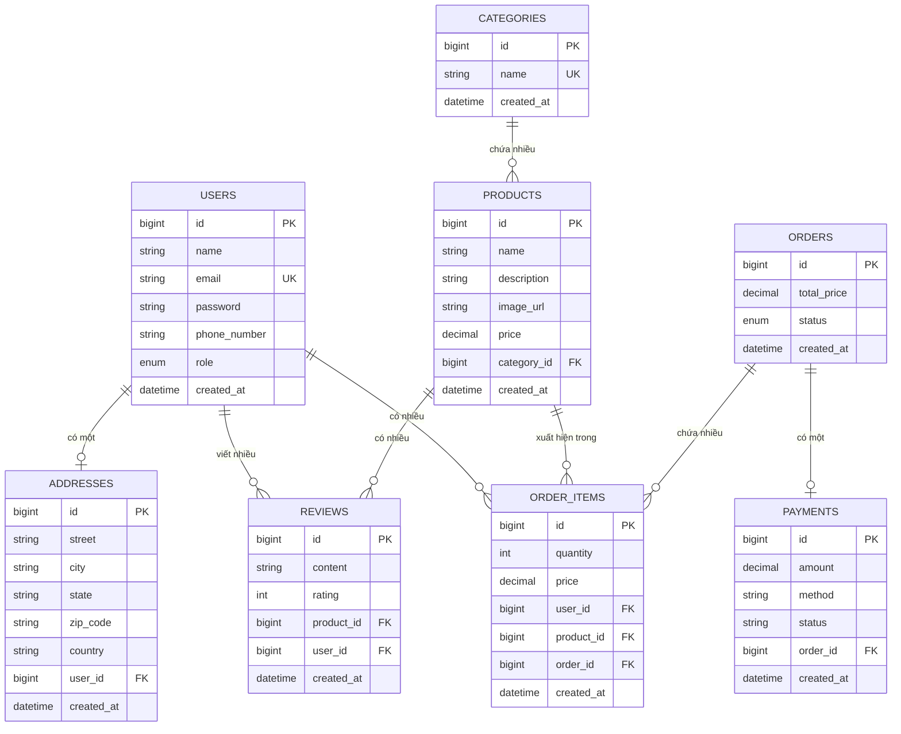

# Sơ Đồ ERD (Entity Relationship Diagram) - Hệ Thống E-commerce Phone Shop

## Mô tả
Sơ đồ ERD mô tả cấu trúc cơ sở dữ liệu và mối quan hệ giữa các bảng.

## ERD Diagram (Mermaid)

## Mô tả Chi tiết các Bảng

### 1. USERS (Người dùng)
- **id**: Khóa chính, tự động tăng
- **name**: Tên người dùng (bắt buộc)
- **email**: Email (duy nhất)
- **password**: Mật khẩu đã mã hóa
- **phone_number**: Số điện thoại
- **role**: Vai trò (ADMIN, NORMAL_ADMIN, USER)
- **created_at**: Thời gian tạo tài khoản

### 2. ADDRESSES (Địa chỉ)
- **id**: Khóa chính
- **street**: Đường/phố
- **city**: Thành phố
- **state**: Tỉnh/Thành
- **zip_code**: Mã bưu điện
- **country**: Quốc gia
- **user_id**: Khóa ngoại → USERS (1-1)
- **created_at**: Thời gian tạo

**Quan hệ**: Một User có một Address (One-to-One)

### 3. CATEGORIES (Danh mục)
- **id**: Khóa chính
- **name**: Tên danh mục (duy nhất)
- **created_at**: Thời gian tạo

**Quan hệ**: Một Category có nhiều Products (One-to-Many)

### 4. PRODUCTS (Sản phẩm)
- **id**: Khóa chính
- **name**: Tên sản phẩm
- **description**: Mô tả
- **image_url**: URL ảnh sản phẩm (lưu trên S3)
- **price**: Giá sản phẩm
- **category_id**: Khóa ngoại → CATEGORIES
- **created_at**: Thời gian tạo

**Quan hệ**: 
- Nhiều Products thuộc một Category (Many-to-One)
- Một Product có nhiều OrderItems (One-to-Many)
- Một Product có nhiều Reviews (One-to-Many)

### 5. ORDERS (Đơn hàng)
- **id**: Khóa chính
- **total_price**: Tổng giá trị đơn hàng
- **status**: Trạng thái (PENDING, APPROVED, REJECTED, CANCELLED, PAID)
- **created_at**: Thời gian tạo

**Quan hệ**: 
- Một Order có nhiều OrderItems (One-to-Many)
- Một Order có một Payment (One-to-One)

### 6. ORDER_ITEMS (Chi tiết đơn hàng)
- **id**: Khóa chính
- **quantity**: Số lượng
- **price**: Giá tại thời điểm đặt hàng
- **user_id**: Khóa ngoại → USERS
- **product_id**: Khóa ngoại → PRODUCTS
- **order_id**: Khóa ngoại → ORDERS
- **created_at**: Thời gian tạo

**Quan hệ**: 
- Nhiều OrderItems thuộc một User (Many-to-One)
- Nhiều OrderItems thuộc một Product (Many-to-One)
- Nhiều OrderItems thuộc một Order (Many-to-One)

### 7. PAYMENTS (Thanh toán)
- **id**: Khóa chính
- **amount**: Số tiền thanh toán
- **method**: Phương thức thanh toán
- **status**: Trạng thái thanh toán
- **order_id**: Khóa ngoại → ORDERS (1-1)
- **created_at**: Thời gian tạo

**Quan hệ**: Một Order có một Payment (One-to-One)

### 8. REVIEWS (Đánh giá)
- **id**: Khóa chính
- **content**: Nội dung đánh giá
- **rating**: Điểm đánh giá (1-10)
- **product_id**: Khóa ngoại → PRODUCTS
- **user_id**: Khóa ngoại → USERS
- **created_at**: Thời gian tạo

**Quan hệ**: 
- Nhiều Reviews thuộc một Product (Many-to-One)
- Nhiều Reviews thuộc một User (Many-to-One)

## Tóm tắt Quan hệ

| Quan hệ | Loại | Mô tả |
|---------|------|-------|
| USERS ↔ ADDRESSES | 1:1 | Một user có một địa chỉ |
| USERS ↔ ORDER_ITEMS | 1:N | Một user có nhiều order items |
| USERS ↔ REVIEWS | 1:N | Một user viết nhiều đánh giá |
| CATEGORIES ↔ PRODUCTS | 1:N | Một danh mục có nhiều sản phẩm |
| PRODUCTS ↔ ORDER_ITEMS | 1:N | Một sản phẩm xuất hiện trong nhiều order items |
| PRODUCTS ↔ REVIEWS | 1:N | Một sản phẩm có nhiều đánh giá |
| ORDERS ↔ ORDER_ITEMS | 1:N | Một đơn hàng có nhiều order items |
| ORDERS ↔ PAYMENTS | 1:1 | Một đơn hàng có một thanh toán |

