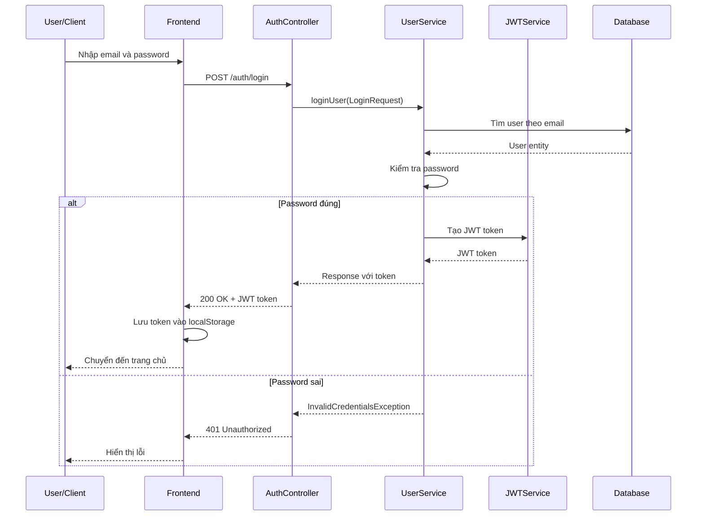
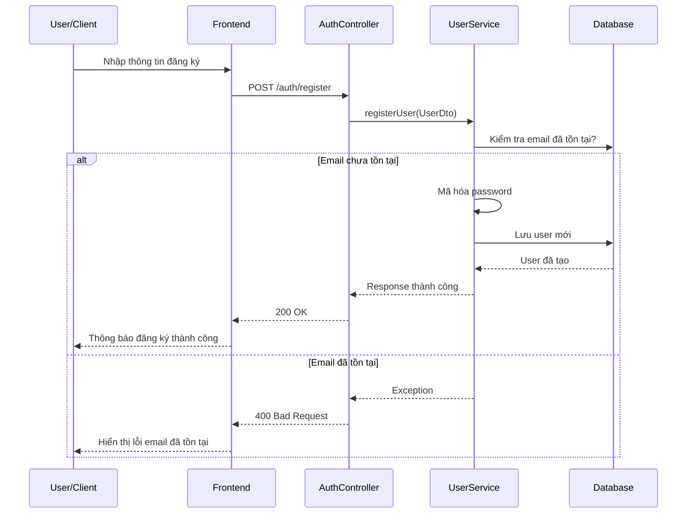
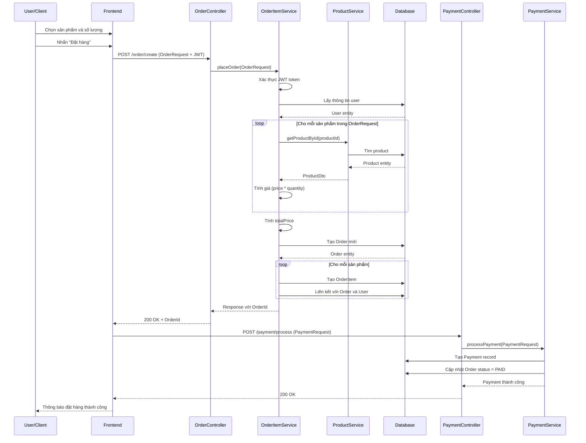
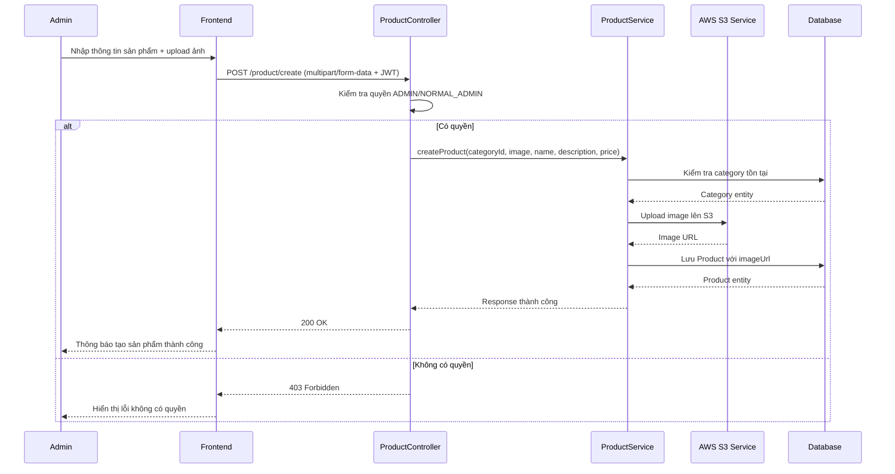
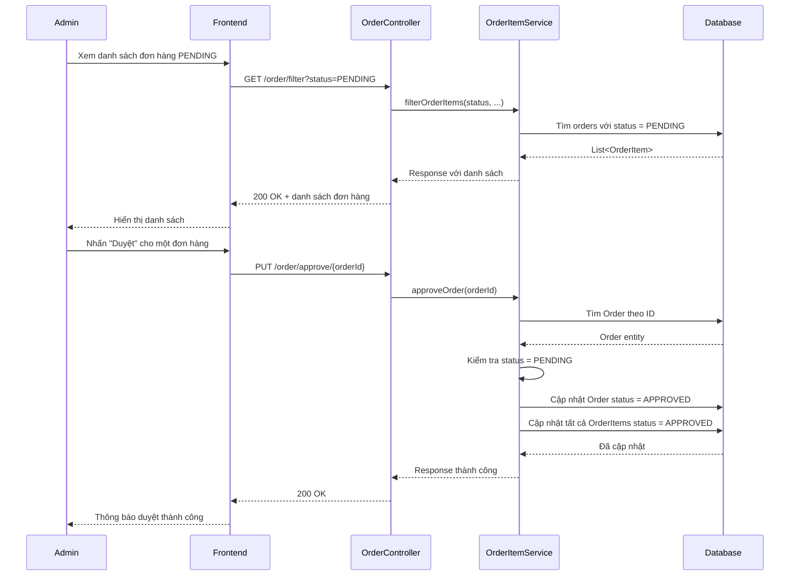
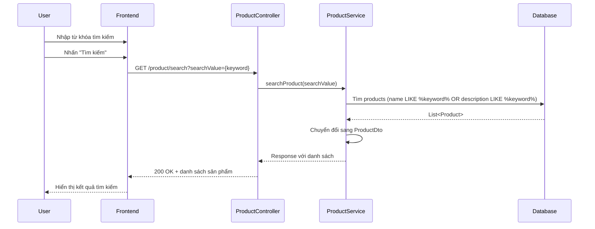
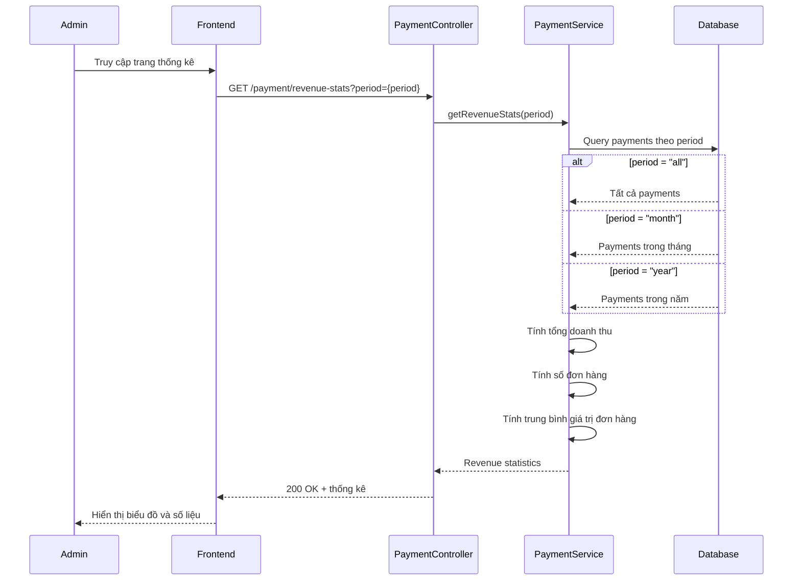

# Sơ Đồ Sequence - Hệ Thống E-commerce Phone Shop

## Mô tả
Các sơ đồ sequence mô tả luồng tương tác giữa các thành phần trong hệ thống.

## 1. Sequence Diagram - Đăng nhập (Login)

## 2. Sequence Diagram - Đăng ký (Register)

## 3. Sequence Diagram - Tạo Đơn hàng (Place Order)

## 4. Sequence Diagram - Tạo Sản phẩm (Admin)

## 5. Sequence Diagram - Duyệt Đơn hàng (Admin)

## 6. Sequence Diagram - Tìm kiếm Sản phẩm

## 7. Sequence Diagram - Xem Thống kê Doanh thu (Admin)

