# Sơ Đồ Use Case - Hệ Thống E-commerce Phone Shop

## Mô tả
Sơ đồ use case mô tả các chức năng chính của hệ thống và người dùng tương tác với hệ thống.

## Actors
- **User (Khách hàng)**: Người dùng thông thường mua sắm
- **Admin**: Quản trị viên cấp cao với đầy đủ quyền
- **Normal Admin**: Quản trị viên cấp thường với quyền hạn hạn chế

## Use Case Diagram (Mermaid)

```mermaid
graph TB
    User[👤 User<br/>Khách hàng]
    Admin[👨‍💼 Admin<br/>Quản trị viên cấp cao]
    NormalAdmin[👨‍💻 Normal Admin<br/>Quản trị viên thường]
    
    subgraph Authentication["🔐 Xác thực"]
        UC1[Đăng ký tài khoản]
        UC2[Đăng nhập]
    end
    
    subgraph ProductManagement["📱 Quản lý Sản phẩm"]
        UC3[Xem danh sách sản phẩm]
        UC4[Xem chi tiết sản phẩm]
        UC5[Tìm kiếm sản phẩm]
        UC6[Lọc sản phẩm theo danh mục]
        UC7[Tạo sản phẩm mới]
        UC8[Cập nhật sản phẩm]
        UC9[Xóa sản phẩm]
    end
    
    subgraph CategoryManagement["📂 Quản lý Danh mục"]
        UC10[Xem danh sách danh mục]
        UC11[Tạo danh mục mới]
        UC12[Cập nhật danh mục]
        UC13[Xóa danh mục]
    end
    
    subgraph OrderManagement["🛒 Quản lý Đơn hàng"]
        UC14[Thêm vào giỏ hàng]
        UC15[Tạo đơn hàng]
        UC16[Xem đơn hàng của tôi]
        UC17[Hủy đơn hàng]
        UC18[Xem tất cả đơn hàng]
        UC19[Lọc đơn hàng]
        UC20[Duyệt đơn hàng]
        UC21[Từ chối đơn hàng]
        UC22[Cập nhật trạng thái đơn hàng]
    end
    
    subgraph PaymentManagement["💳 Quản lý Thanh toán"]
        UC23[Xử lý thanh toán]
        UC24[Xem thông tin thanh toán]
        UC25[Xem thống kê doanh thu]
    end
    
    subgraph UserManagement["👥 Quản lý Người dùng"]
        UC26[Xem thông tin cá nhân]
        UC27[Cập nhật thông tin cá nhân]
        UC28[Xem tất cả người dùng]
        UC29[Tạo Normal Admin]
        UC30[Cập nhật Normal Admin]
        UC31[Xóa Normal Admin]
        UC32[Xem tất cả Admin]
    end
    
    subgraph AddressManagement["📍 Quản lý Địa chỉ"]
        UC33[Xem địa chỉ]
        UC34[Tạo/Cập nhật địa chỉ]
    end
    
    %% User connections
    User --> UC1
    User --> UC2
    User --> UC3
    User --> UC4
    User --> UC5
    User --> UC6
    User --> UC10
    User --> UC14
    User --> UC15
    User --> UC16
    User --> UC17
    User --> UC23
    User --> UC24
    User --> UC26
    User --> UC27
    User --> UC33
    User --> UC34
    
    %% Admin connections
    Admin --> UC2
    Admin --> UC7
    Admin --> UC8
    Admin --> UC9
    Admin --> UC11
    Admin --> UC12
    Admin --> UC13
    Admin --> UC18
    Admin --> UC19
    Admin --> UC20
    Admin --> UC21
    Admin --> UC22
    Admin --> UC25
    Admin --> UC28
    Admin --> UC29
    Admin --> UC30
    Admin --> UC31
    Admin --> UC32
    
    %% Normal Admin connections
    NormalAdmin --> UC2
    NormalAdmin --> UC7
    NormalAdmin --> UC8
    NormalAdmin --> UC9
    NormalAdmin --> UC11
    NormalAdmin --> UC12
    NormalAdmin --> UC13
    NormalAdmin --> UC18
    NormalAdmin --> UC19
    NormalAdmin --> UC20
    NormalAdmin --> UC21
    NormalAdmin --> UC22
    NormalAdmin --> UC25
    
    style User fill:#e1f5ff
    style Admin fill:#ffe1e1
    style NormalAdmin fill:#fff4e1
    style Authentication fill:#f0f0f0
    style ProductManagement fill:#e8f5e9
    style CategoryManagement fill:#fff3e0
    style OrderManagement fill:#f3e5f5
    style PaymentManagement fill:#e0f2f1
    style UserManagement fill:#fce4ec
    style AddressManagement fill:#e8eaf6
```

## Chi tiết Use Cases

### 1. Xác thực (Authentication)
- **Đăng ký**: User tạo tài khoản mới
- **Đăng nhập**: Xác thực người dùng và cấp JWT token

### 2. Quản lý Sản phẩm (Product Management)
- **Xem danh sách**: Liệt kê tất cả sản phẩm
- **Xem chi tiết**: Xem thông tin chi tiết một sản phẩm
- **Tìm kiếm**: Tìm sản phẩm theo từ khóa
- **Lọc theo danh mục**: Xem sản phẩm trong một danh mục
- **Tạo/Cập nhật/Xóa**: Chỉ Admin và Normal Admin

### 3. Quản lý Danh mục (Category Management)
- **Xem danh sách**: Tất cả người dùng
- **Tạo/Cập nhật/Xóa**: Chỉ Admin và Normal Admin

### 4. Quản lý Đơn hàng (Order Management)
- **Tạo đơn hàng**: User tạo đơn từ giỏ hàng
- **Xem đơn hàng**: User xem đơn của mình, Admin xem tất cả
- **Hủy đơn**: User có thể hủy đơn của mình
- **Duyệt/Từ chối**: Admin và Normal Admin
- **Lọc đơn hàng**: Theo trạng thái, ngày tháng, ID

### 5. Quản lý Thanh toán (Payment Management)
- **Xử lý thanh toán**: User thanh toán đơn hàng
- **Xem thông tin**: Xem chi tiết thanh toán
- **Thống kê doanh thu**: Chỉ Admin và Normal Admin

### 6. Quản lý Người dùng (User Management)
- **Xem thông tin cá nhân**: User xem và cập nhật thông tin
- **Quản lý Admin**: Chỉ Admin cấp cao có thể tạo/sửa/xóa Normal Admin

### 7. Quản lý Địa chỉ (Address Management)
- **Xem/Cập nhật địa chỉ**: User quản lý địa chỉ giao hàng

